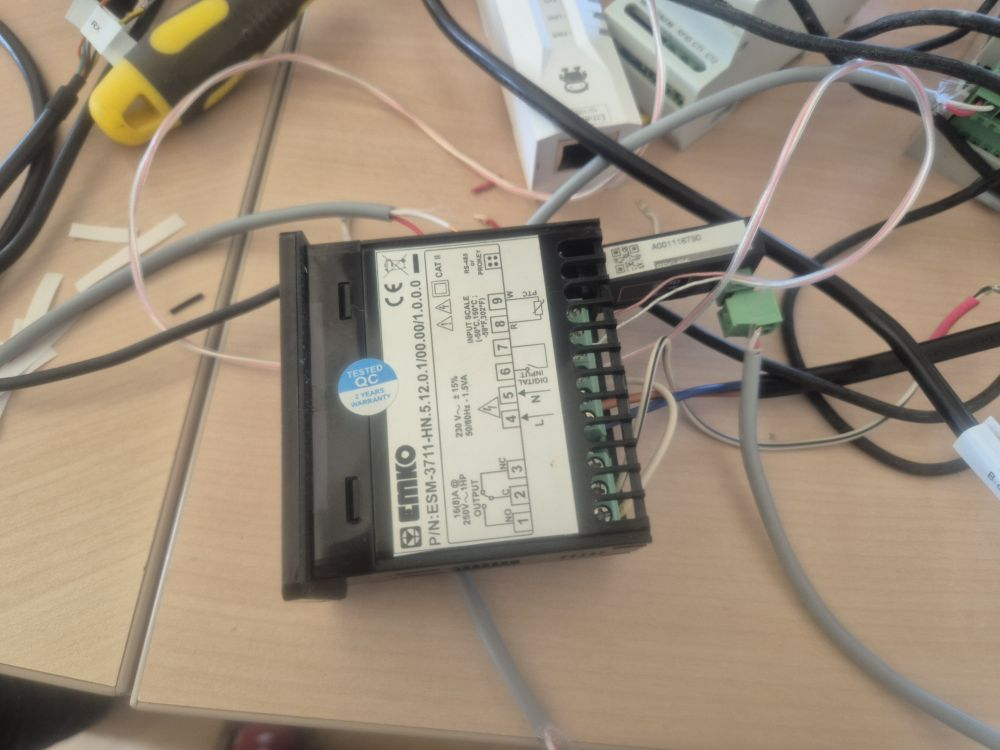
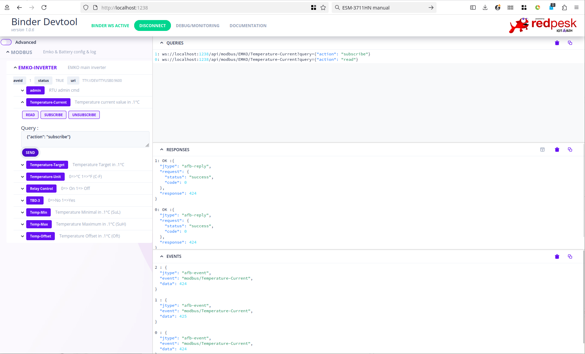

# Emko Modbus Thermostat

## Module configuration

### Modbus TTY config:
 * baud: 9600
 * prarity: none

### Device configuration:
 * PrC: should be set to '1' to validate modbus
 * SAd: modbus Slave-ID
 * Prt: protection should be zero

### WARNING: Documented modbus register value are useless
 * register 40001 is Read-Holding/Addr:0
 * register 30001 is Read-Input/Addr:0
 Check: modbus-emko-tty.yaml for reversed engineering values

Connection


Debug UI


## Export with MQTT to HomeAssistant

### Calling AFB verbs from MQTT

#### MQTT/AFB Event bridge

List Api/sensors you want export to MQTT. Note that by default only updated values are exported. Would you want to receive value when stable use the 'idle' parameter. The template allows you to create a custom JSON format that fit your application expectations.

```
to-mqtt:
  event:
    registrations:
      - api: tty-rs845
        verb: EMKO/Temperature-Current
        args:
          action: subscribe
    template:
      data: "%{data}"
```

#### MQTT/AFB Api bridge. 

By default all API are accessible from MQTT. Would you want to restrict API exposure add a 'filter' rule.

```
subscribe-topic: emko-rqt
from-mqtt:
  api: tty-rs845
  request-extraction:
    verb-path: .verb
    data-path: .data
  response-template:
    name: ${verb}
    data: ${data}
```
Notes: topic/api depend on your AFB configuration

#### Test with a simple mosquitto_pub request.
```
MQTT_USER=yyy
MQTT_SECRET=xxxx
mosquitto_pub  -h localhost -u $MQTT_USER -P $MQTT_SECRET -t 'emko-rqt' -m '{ "verb": "EMKO/Temperature-Target", "action": "write", "data":280 }}'
```


